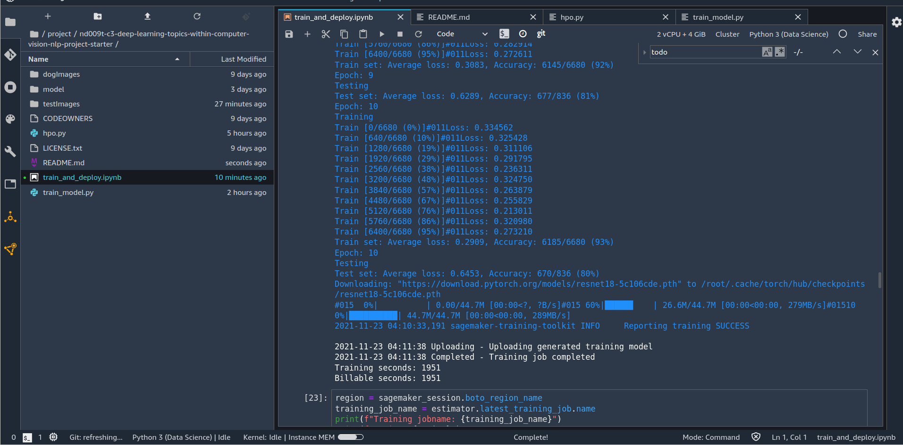

# Dog Breed Classifier Project BY SANCHARIKA DEBNATH
# Image Classification using AWS SageMaker

This project takes a pretrained CNN model (Resnet18) and finetunes it for use in classifying dog breeds into 133 classifications based on a Dog Breeds dataset.

The steps that the notebook goes through are:

1. Retrieving a dataset
1. Uncompressing that dataset.
1. Uploading that dataset to an S3 bucket.
1. Setting up hyperparameter tuning using learning rate, weight decay, eps and batch size using the AdamW optimizer on ResNet18.
1. Starting a hyperparameter tuning job using 20 training jobs (2 at a time) with autoshutdown on the AWS SageMaker Hyperparameter Tuning system.
1. Record the best hyperparameters as discovered from the above.
1. Train a fine-tuned model using ResNet18 and the best hyperparameters over a larger number of epochs, recording profiling and debug data.
1. Examine the output from the profiling and debug of the above.
1. Re-run the training with profiling and debug turned off (due to issues deploying model trained with the above).
1. Deploy that model as an endpoint on AWS.
1. Test that endpoint with new images.

## Hyperparameter Tuning
The ResNet18 model with a single layer Linear NN is used. ResNet18 is a 
well proven pretrained CNN and the results of a single layer NN was enough to 
get good results from training. The hyperparameters used to tune were: 
1. Learning rate 
2. eps 
3. Weight decay 
4. Batch size 
These hyperparameters gave broad coverage of the tunables for the system. Values used between 0.1x and 10x the default as the default values tend to give good results for the first 3, and for batch size -the options of 32 and 64. 

### Results

## Model Deployment
The deployed model runs a tuned version of ResNet18 and accepts data as preprocessed in the notebook.

